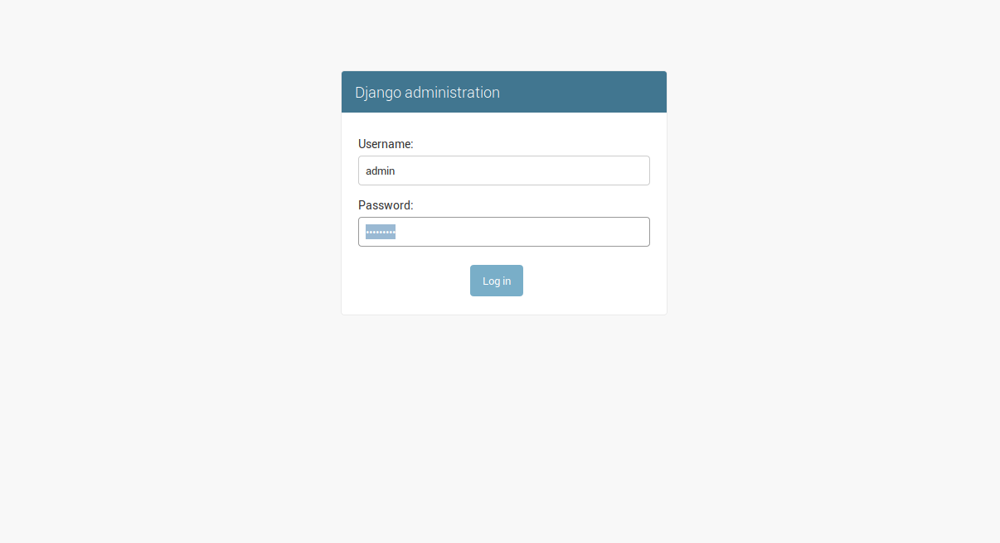
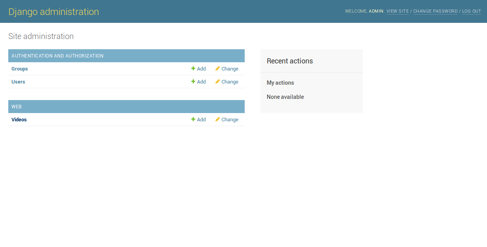
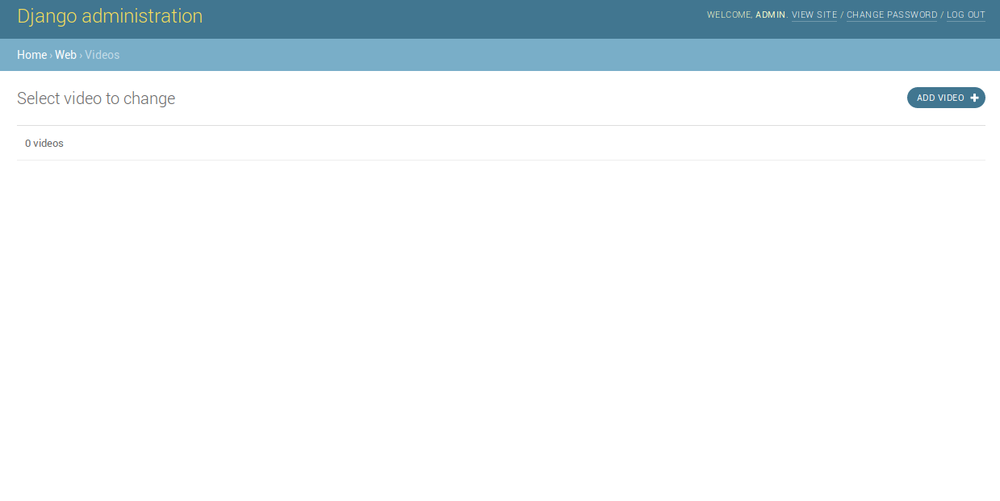
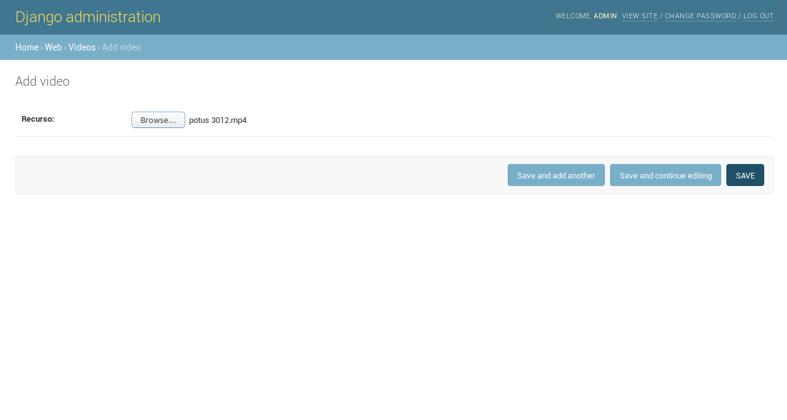
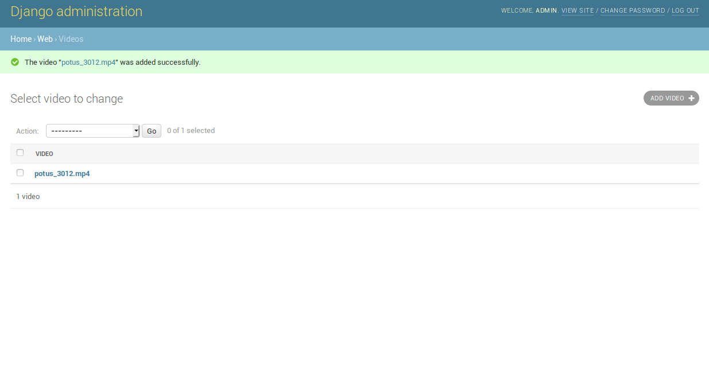

# UploadVideos

Login to django admin (the password is helloworld)

In our application called web we have created the video model

Let's add something new

In this case a video

If everything goes okay

We go to the only url we have and we can see our video listing and ready to play

## Resources
The example video comes from:
- https://vimeo.com/58460459

## Credits
This project would not be possible without:
- https://www.djangoproject.com/
- https://creativecommons.org/
